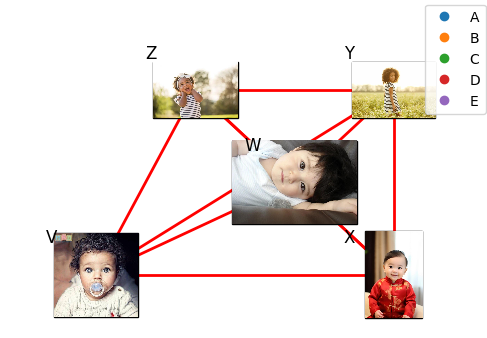

# Python Plot Intro
## String Board Chart with Images

Demonstrates how to create a dynamic "string board chart" with images linked by random connections, simulating a crime scene investigation board. The code randomly positions images on a grid and draws red lines linking them based on random pairs. Names are tag to the images. 

### Files
: Python script that generates the string board chart with images.
: Example output image generated.

